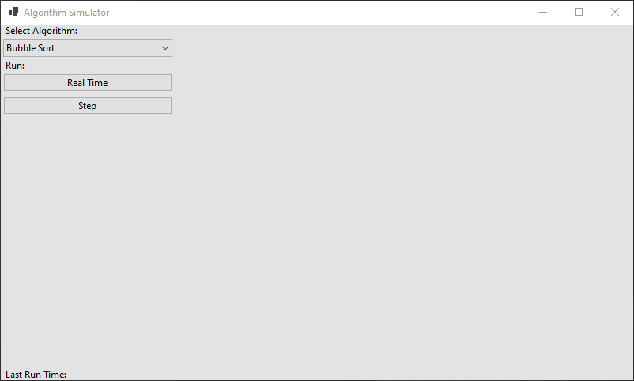
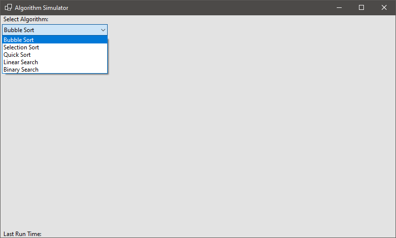
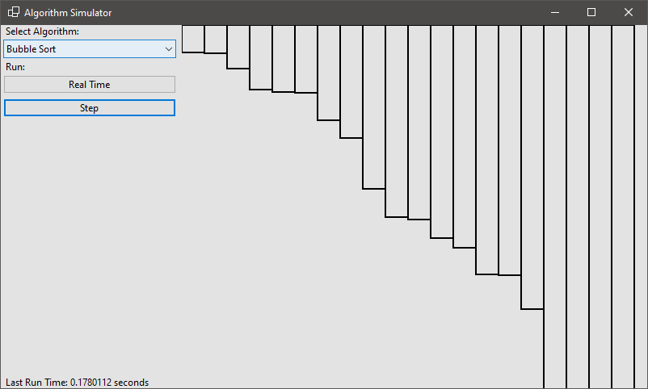
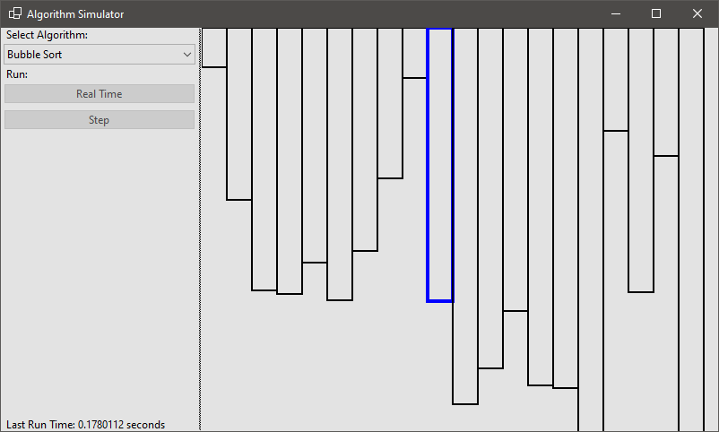

# Sorting and Searching Algorithm Simulator

## Purpose
The purpose of the app is to demonstrate multiple search
and sort algorithms to students to help them learn the algorithms.

## User Guide
### Step 1
Once the application has opened you will see the screen shown in figure 1.

### Step 2
This window will allow you to select an algorithm from the
drop-down box (shown in figure 2).

### Step 3
After you have selected the algorithm you want to simulate,
you can either run the algorithm in real-time or
step-by-step (which introduces a delay for each step).

#### Real Time
If you click the "real time" button the algorithm will run and
you will see the final sorted elements. The run time of the algorithm
is shown at the bottom left hand corner and is
displayed in seconds (shown in figure 3).

#### Step
If you click the "step" button the selected algorithm will run and
after each step it will wait 250ms before running the next step.
During each step the display will also show you the current pointers
that the algorithm is
comparing/switching (these are displayed in blue) (shown in figure 4).

### Notes
- During the algorithm running the drop-down box, "real time" and "step"
buttons will be disabled to prevent starting another algorithm while one is running.
- The run time will also only update on the algorithms completion.
- Depending on the algorithm selected and the speed of your computer
the algorithms may take a while in real-time.
- The display can handle resizes while the algorithm is running,
so the widths of the columns will change to make sure 100% of the window is used.

## License
Copyright (C) 2021  Leo Spratt

This program is free software: you can redistribute it and/or modify
it under the terms of the GNU General Public License as published by
the Free Software Foundation, either version 3 of the License, or
(at your option) any later version.

This program is distributed in the hope that it will be useful,
but WITHOUT ANY WARRANTY; without even the implied warranty of
MERCHANTABILITY or FITNESS FOR A PARTICULAR PURPOSE.  See the
GNU General Public License for more details.

You should have received a copy of the GNU General Public License
along with this program.  If not, see <https://www.gnu.org/licenses/>.
